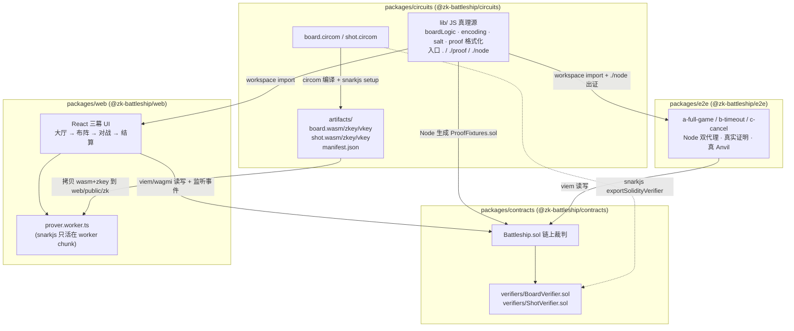
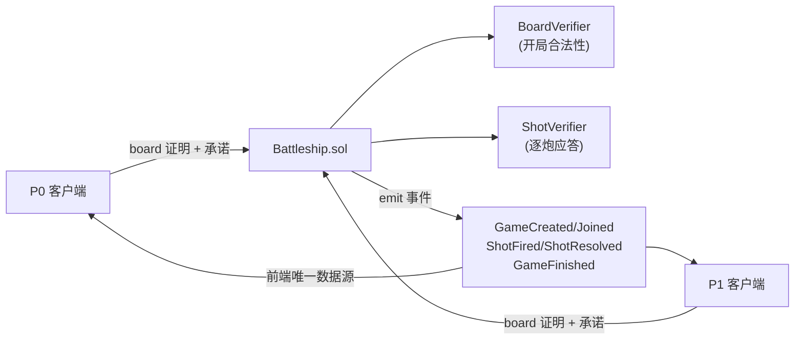
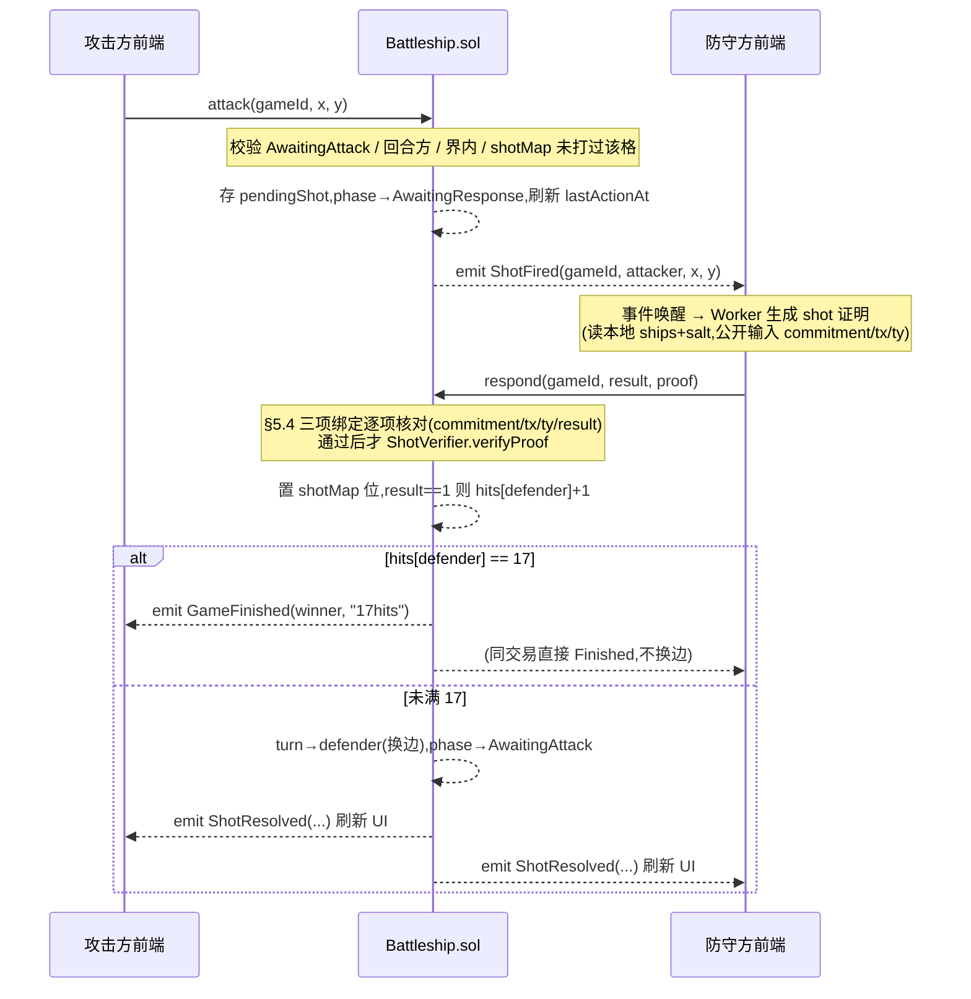

# ZK Battleship — 链上海战棋

双人链上海战棋:**布船以 Poseidon 承诺上链**(整局棋盘从不公开),**每一炮应答附 Groth16 零知识证明**(hit/miss 被数学锁死、无法谎报),**回合、超时与胜负全由合约裁判**。前端是一个有完整氛围感的"冷战声呐作战室"。

不托管资金,面向本地链与测试网,MVP 为荣誉对局——这是一次认真的 ZK 工程练习,把"承诺 + 逐步证明"范式落到一个有真实对抗面的小游戏上。

- 电路:circom 2.1.9 + snarkjs 0.7.6,Groth16(`board.circom` 开局合法性 / `shot.circom` 逐炮应答)
- 合约:Solidity(pragma `^0.8.24`,solc `0.8.28`),Foundry,单文件 `Battleship.sol` + 两个 snarkjs 导出 verifier
- 前端:Vite + React 18 + TypeScript + Tailwind v4,viem + wagmi v2,**证明在 Web Worker 里跑**
- 端到端:Node + Anvil,真实证明三脚本
- 包管理:pnpm workspace(monorepo)

---

## 快速开始(克隆 · 构建 · 在线试玩)

### 在线试玩(免安装)

浏览器直接打开 **http://101.35.224.67:8080** —— 部署在自建 **GoQuorum QBFT 联盟链**(链 ID `1204`、免 gas)上的公网版本。每个浏览器进来**自动分配一个独立链上身份**(本地生成私钥、0 余额即玩;合约按 `msg.sender` 鉴权,对手无法替你出招)。玩法:建一局拿到对局编号 `#N` 发给对手 → 对手用编号加入 → 自动进对战幕、轮流开炮并自动应答;换个浏览器 / 设备 / 无痕窗口就是另一个身份,可以自己和自己对打。

> nginx 同源托管:`8080` 直出静态前端 + `/rpc` 反代联盟链节点;前端用 `当前源 + /rpc` 自适应 RPC,零跨域。完整部署拓扑(3 节点 docker-compose + nginx 配置)见 [`infra/`](infra/)。

### 本地克隆 + 构建

`packages/contracts/lib/forge-std` 是 git 子模块,克隆**务必带 `--recurse-submodules`**(否则合约编译 / 测试会缺依赖):

```bash
git clone --recurse-submodules https://github.com/SorAsk1204/zk-battleship.git
cd zk-battleship
pnpm install
```

> 已经 clone 但漏了子模块?补一句即可:`git submodule update --init --recursive`。

电路 artifacts(wasm/zkey/vkey ≈ 17MB)随仓库提交,**克隆即用**,无需下载 72MB ptau 或重跑 trusted setup。装好依赖后:

- **本地一键演示**:`pnpm demo` → 起 Anvil + 程序化部署 + dev server,打开 `http://127.0.0.1:5173`,用右上角 P0/P1 切换器在同一页打完整一局。
- **全量测试**:`pnpm test:all` → 按序跑 circuits / contracts / e2e / web 四个包(含真实证明的 e2e)。

前置工具版本(Node ≥ 22、pnpm 11.x,以及仅在重编电路 / 跑合约时才需要的 circom、Foundry)与各步骤细节见下文 **§4 运行步骤**。

---

## 1. 架构

四个 workspace 包,产物(artifacts + verifier.sol)是把它们串起来的关键:电路一端编译出 wasm/zkey/vkey 与 Solidity verifier,wasm/zkey 流向前端 Worker、verifier.sol 流向合约,JS 真理源(`@zk-battleship/circuits` 的纯逻辑)被前端 / e2e / 合约 fixture 三方共用,杜绝"承诺输入数组各拼各的"。



**组件视角:链上裁判 + ZK 应答**。合约不信任任何客户端报来的结果——它只信两样东西:开局时 board 证明保证"棋盘合法"(舰型对、界内、不重叠),应答时 shot 证明 + §5.4 三项绑定保证"这一炮的 hit/miss 是真的、且谈论的就是本局这一格"。证明在客户端(浏览器 Worker 或 Node)本地生成,链上只做 ~一次配对验证。



仓库结构:

```
battleship/
├── Design.md                 设计规格书(锁定项的来源)
├── DECISIONS.md              实现决策记录(D1–D14 + 执行期逐任务)
├── pnpm-workspace.yaml
├── package.json              根:test:all / demo 两个脚本
├── scripts/demo.ts           pnpm demo 入口
└── packages/
    ├── circuits/             电路 + JS 真理源 + 编译/setup 脚本 + 提交入库的 artifacts/
    ├── contracts/            Battleship.sol + 两 verifier + forge 测试
    ├── web/                  React 三幕前端 + Worker 证明管线
    └── e2e/                  Node 双代理脚本(真实证明,Anvil)
```

---

## 2. 单回合时序

一个回合 = 一次 `attack` + 一次 `respond`(无论 hit 或 miss 都换边——不采用经典规则的"命中再打一炮",保持回合对称、状态最少)。对照 Design §4.5:



要点:

- **防守方无需手动点击**。前端订阅 `ShotFired`,轮到自己应答时 `useAutoRespond` 自动在 Worker 里出证、发 `respond`。关页再开、换设备导入棋盘后重开,只要链上仍"待我应答",effect 挂载即自动补跑——触发条件全是链上派生量,无"我刚做了什么"的本地记忆(§10)。
- **超时不行动会判负**。`attack` 与 `respond` 都刷新 `lastActionAt`;义务方超过 `TIMEOUT = 300 秒`不行动,非义务方可调 `claimTimeout()` 直接获胜。
- **前端永不手动刷新**。事件是 UI 的唯一数据源(wagmi `watchContractEvent` 实时增量),`getGame()` 的 struct 是状态真理源。

---

## 3. 密码学协议

整局棋盘从不上链,但每一次应答都被锁死。三个机制:开局把棋盘藏进 Poseidon 承诺、board 电路证明这个被藏的棋盘合法、shot 电路逐炮证明应答真实且不可换棋盘 / 换格子。

### 3.1 布船编码与承诺(§5.1)

- 布船方案 = 15 个标量 `(x0,y0,d0, x1,y1,d1, …, x4,y4,d4)` + 随机 `salt`。`dir=0` 水平、`dir=1` 垂直;5 舰长度固定 `[5,4,3,3,2]`,合法船格恒为 17。
- **承诺 = Poseidon(16 inputs)**,输入顺序固定:
  `[x0,y0,d0, x1,y1,d1, x2,y2,d2, x3,y3,d3, x4,y4,d4, salt]`。
  circomlib Poseidon 最大支持 16 输入,这里正好用满。**顺序写错前后端承诺就对不上**,所以前端 / e2e / 合约 fixture 全部走 `@zk-battleship/circuits` 同一个编码函数,禁止任何一方自己拼数组(D2)。
- `salt` 由客户端 `crypto.getRandomValues` 生成 ≥128 bit。承诺的隐藏性**完全依赖 salt 熵**:没有 salt,布船空间只有 ~3×10¹³,可被暴力枚举还原。

### 3.2 board.circom(开局合法性,**15334 约束**)

- 私有输入 `ships[5][3]`(x,y,dir)、`salt`;公开输出 `commitment`。
- 约束:每个 x,y ∈ [0,9]、dir ∈ {0,1};每艘船界内(用 dir 线性混合算船尾 ≤ 9);**全部 100 格逐格占用 ∈ {0,1}**(无重叠 —— `occ[c]*(occ[c]-1)==0`);`commitment === Poseidon(ships, salt)`。
- 作用:**开局即证明"我藏起来的这副棋盘是合法布阵"**,对手看不到棋盘但确信它不是作弊布局。

### 3.3 shot.circom(逐炮应答,**888 约束**)

- 私有输入 `ships[5][3]`、`salt`;公开输入 `commitment, tx, ty`(本回合被攻击坐标);公开输出 `result`(1=hit / 0=miss)。
- 约束:`Poseidon(ships, salt) === commitment`(绑定开局承诺,**防换棋盘**);`result = OR_{5 舰} inShip(s, tx, ty)`。
- 这个电路**只判定一个格子、不重建 100 格棋盘**——这就是它只有几百约束、浏览器里亚秒出证的原因。
- 作用:**每一炮的 hit/miss 由证明本身保证为真**,防守方无法谎报(报假 miss 会让证明不可满足)。

### 3.4 公开输入三项绑定(§5.4,全系统防作弊关口)

证明本身只保证"对 `pubSignals` 里的那个棋盘 / 那个格子,结果是 `pubSignals[0]`"。证明谈论的是不是**本局链上状态**,全靠合约 `respond` 逐项核对——且**必须在 `verifyProof` 之前**:

`shot.circom` 公开信号布局 = `[result, commitment, tx, ty]`。合约对照:

| 核对项 | 校验 | 防的攻击 |
|---|---|---|
| `pubSignals[1] == 防守方承诺` | 换棋盘 | 否则可用另一块"全 miss 棋盘"的合法证明永远报 miss |
| `pubSignals[2..3] == (pendingX, pendingY)` | 换格子 | 否则可拿自己棋盘任一空格的合法 miss 证明应答任意炮击 |
| `pubSignals[0] == result` 入参 | 篡改应答值 | 事件 / hits 采信的是 result 参数,必须与证明输出逐位一致 |

任何一项不符 → `revert PROOF_MISMATCH`。合约测试专门覆盖"用别的格子 / 别的棋盘的合法证明来应答"这条攻击路径。`createGame` / `joinGame` 同理:`pubSignals[0] == commitment`,防"拿任意一份合法证明配假承诺入库"(否则可存一个自己根本开不出来的承诺、赖掉后续应答义务)。

### 3.5 verifier

两个 verifier 由 snarkjs 0.7.6 直接导出为 Solidity(`BoardVerifier.sol` 公开输入 N=1、`ShotVerifier.sol` N=4),constructor 注入合约后不可变。snarkjs verifier 的语义是**证明无效返回 `false` 而不 revert**,合约一律 `require(... , "BAD_PROOF")` 检查返回值。本项目电路小,从 M1 起就用真实 verifier,无任何 mock。

---

## 4. 运行步骤

### 前置

| 工具 | 版本 | 说明 |
|---|---|---|
| Node | ≥ 22 | 根 `package.json` engines 锁定 |
| pnpm | 11.x | `packageManager: pnpm@11.5.3` |
| circom | 2.1.9 | 仅在重新编译电路(`circuits build`)时需要;clone 即用的 artifacts 已入库 |
| Foundry (forge) | 1.7.x | 合约编译 / 测试 |

> **Windows 仓库路径不得含空格**:`circom_tester` 内部 `exec` 不加引号,路径含空格会断。这是全仓硬纪律,测试启动代码也会断言。

### 安装

```bash
pnpm install
```

artifacts(wasm/zkey/vkey ≈17.1MB)随 git 提交,clone 即用,无需下载 72MB ptau 或重跑 setup。

### 一键演示

```bash
pnpm demo
```

`scripts/demo.ts` 做四件事:启动 **Anvil**(`127.0.0.1:8545`)→ viem 程序化**部署**两 verifier + Battleship → 写 `web/public/deployment.json` → 起 **web dev server**(`127.0.0.1:5173`,注入 `VITE_DEMO=1`)。打开 `http://127.0.0.1:5173`,页面右上角有 **P0/P1 双账户切换器**(仅 demo 模式显示),同一页面就能用两个 Anvil 账户打完整一局:P0 布阵锁定 → 切 P1 加入 → 自动进对战幕 → 轮流开炮、自动应答。`Ctrl+C` 退出会按序清理 dev server 子进程树与 Anvil(Windows 无进程组,用 `tree-kill` 才能带走孙进程)。

> demo 用的是 Anvil 公知测试私钥(助记词 `test test … junk`),仅本地链,前端经自建 local-account connector 本地签名(不持你的真私钥)。

### 全量测试

```bash
pnpm test:all
```

按序跑四个包(任一失败即整体失败):

- **circuits**(mocha + tsx):board / shot 电路单测 —— 合法布阵 → 承诺正确;重叠 / 出界 / dir∉{0,1} → witness 不可满足;对已知布阵全 100 格断言 hit/miss 与 JS 参考实现一致。
- **contracts**(forge):状态机全路径 + 每个 `require` 的反向用例;攻击专项(重复打同格、非回合方 attack、§5.4 三项绑定各 break 一项);不变量(hits 单调 ≤17、Finished 后任何函数 revert、shotMap 置位数 == ShotResolved 事件数)。
- **e2e**(Node + Anvil,**真实证明**):`a-full-game` 打满 17 命中断言 winner 与事件序列、`b-timeout` 防守方停止应答后 `claimTimeout` 获胜、`c-cancel` 无人加入快进 24h 后 `cancelGame`。每个场景独立子进程隔离 snarkjs 残留线程与 Anvil 生命周期。
- **web**(vitest):纯逻辑核单测(归约器 / 派生 / 几何 / 证明参数格式化 / 坐标映射 / 声呐相位等,394 例)。React 钩子取数走真浏览器验收,node 环境无 testing-library。

---

## 5. 安全注记(§5.5,重点)

这是一次 ZK 练习,以下是它**诚实**的安全边界——既写清哪些攻击被挡住,也写清哪些假设是承重的、生产化前必须替换。

- **同一证明重放无害,无需防**。对固定 `(commitment, tx, ty)`,result 是确定的;同一份证明重放会被 phase 机制(已应答 → 不再是 `AwaitingResponse`)挡掉,不构成攻击面。

- **跨局重用同一布船 + salt 有害,每局必须新 salt**。承诺的隐藏性完全靠 salt 熵。上一局结束后对手已知你的布阵;若下一局沿用同一 `(ships, salt)`,承诺值相同 → 布阵可被关联、旧证明可被复用。客户端**每局生成新 salt**。

- **开发期 setup 的 trusted setup 不可信,生产需 MPC ceremony**。本仓 setup 用 `zKey.newZKey` 直出 final zkey、**不做 contribute**(D6:确定性已用双跑 sha256 逐字节比对实证,故 artifacts 可复现入库)。代价是 **delta 已知** —— 掌握 toxic waste 者理论上能伪造证明。这对本地荣誉对局无所谓,但**生产部署必须做多方 MPC ceremony** 重新 setup。

- **脚本对战是特性、不是漏洞**。合约无法阻止玩家用脚本(而非前端 UI)对战;链上裁判**不信任客户端**,无论谁来调用,作弊都被 board/shot 证明 + §5.4 绑定挡死。这是全链游戏的本质,e2e 三脚本正是"用脚本对战"。

- **salt / 棋盘丢失 = 无法应答 = 必然超时输**。布船 + salt 持久化在 `localStorage`(键 `bs:{chainId}:{contract}:{gameId}:{address}`)。丢失后无法再生成应答证明,只能眼睁睁超时判负。这正是 §8 持久化 + "导出部署文件" / 导入恢复的动机:锁定舰队成功后可导出 JSON,进对战幕时校验本地数据能重算出链上承诺、不符则常驻横幅告警并给导入入口;棋盘缺失时前端**大声阻断**(`role=alert` 横幅),绝不静默弃权。

---

## 6. 工程注记

**事件重建"只扫最近 N 万块"(§10)**。大厅的进行中对局列表、单局的历史 hit/miss,都靠回放合约事件重建(indexer-less)。本地 Anvil 从 `deployBlock` 全扫即可;**测试网**事件多、全扫会慢,可改 `fromBlock = max(deployBlock, head - N)`(代码已留注记)。影响:超过窗口的极老对局可能不在列表里——对 MVP 可接受,要完整历史则上 indexer。本地链无重组,"事件触发 refetch"这条简化安全;测试网若有重组需在 watch 层加确认数,派生 / 取数层不动。

**gas(真值,`packages/contracts/.gas-snapshot`)**。forge 无优化器字节码、单笔操作计量(前置编排全在 `setUp`):

| 操作 | gas |
|---|---|
| `createGame` | 305,878 |
| `joinGame` | 268,448 |
| `attack` | 32,317 |
| `respond`(miss) | 275,272 |
| `respond`(hit) | 296,134 |
| `respond`(第 17 命中,直接 Finished) | 269,985 |

`respond` 的大头是 ShotVerifier 的 bn254 配对验证。这些数字**只记录、不做 CI 门禁**:Groth16 证明点含 prover 随机数,每次重新生成 fixture 的 calldata 非零字节都变,gas 天然抖动,靠人审 diff(D 见 Task 1.11)。

**Windows 专项纪律**(踩过的坑,全仓约定)。

- 仓库路径不含空格(`circom_tester` 内部 exec 不加引号)。
- RPC 一律 `127.0.0.1` 不用 `localhost`(Node 17+ 可能把 localhost 解析成 `::1`,Anvil 显式 `--host 127.0.0.1`)。
- 全部脚本走 **tsx**、零 bash;snarkjs 脚本结尾 `process.exit` / mocha `--exit`(snarkjs 残留 worker 线程不退出)。
- 子进程树清理一律 **tree-kill**(Windows 无进程组,`cmd.exe → pnpm → node → vite` 多级树,kill 顶层带不走孙进程会残留占端口)。
- spawn 范式:真 exe(circom/anvil/forge)用 `execa` 数组传参;`pnpm`(实为 `.cmd` shim)Node ≥22 不能裸 spawn(CVE-2024-27980 防护 → EINVAL),须 `{ shell: true }` 或 `execaNode(script, { nodeOptions: ['--import','tsx'] })`。

**前端浏览器安全维持**。snarkjs 只活在 worker chunk —— 主 bundle grep `groth16 / snarkjs / ffjavascript / exportSolidityCallData / powersOfTau / wtns` 全 0,证明生成与 calldata 格式化都在 Worker 内完成,主线程不被拖进重依赖。

---

## 7. 参考

- Design.md —— 完整设计规格(游戏规则 §4、密码学协议 §5、合约 §6、边界裁决 §10 等锁定项的来源)。
- DECISIONS.md —— 逐条实现决策(snarkjs 版本钉死、JS 真理源、Worker 证明拆分、demo connector 等的真实理由)。
- Dark Forest(链上隐藏信息范式)、BattleZips / zku.one(同类 Battleship 电路写法)、circomlib、snarkjs。
