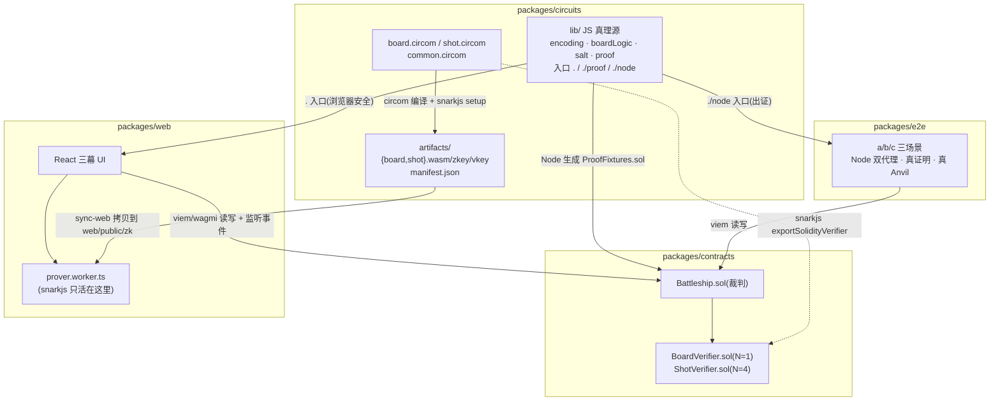
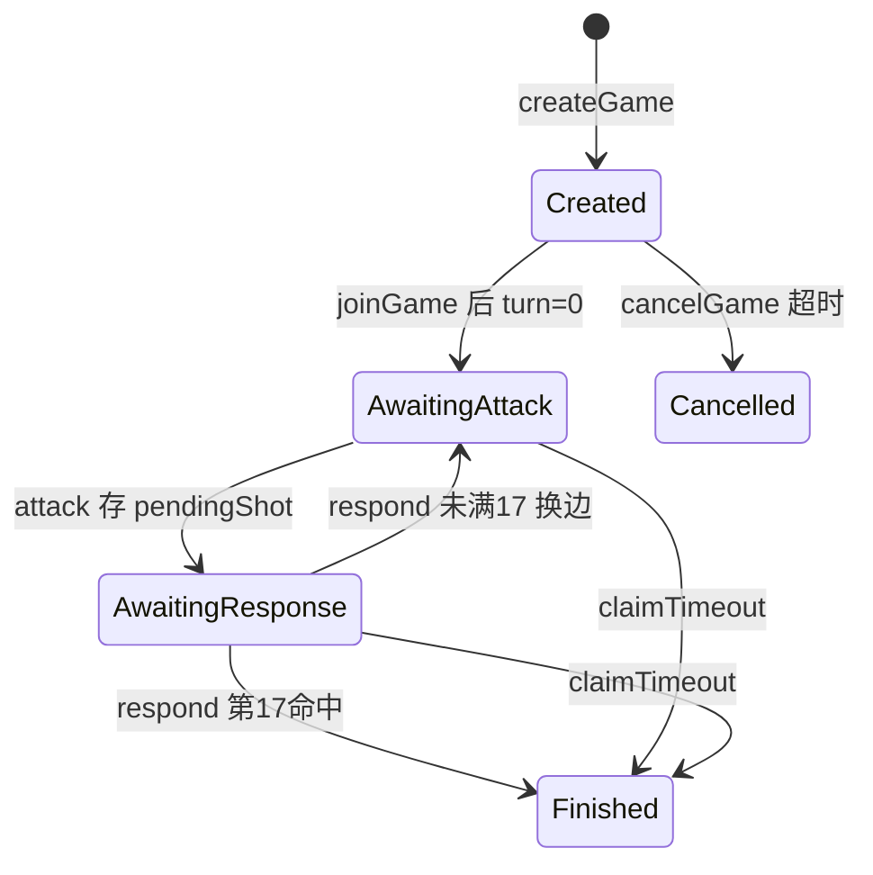
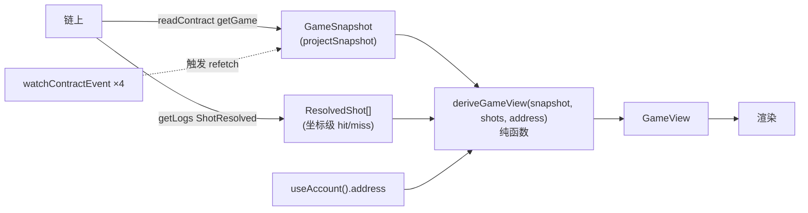

# ZK Battleship 架构文档

> 这是一份**代码级实现地图**,写给要改、要审、或想照着学这套代码的人。它和仓库里另外三份文档分工如下:
>
> | 文档 | 角色 | 何时读 |
> |---|---|---|
> | `README.md` | 项目概览 + 运行步骤 + 在线试玩 | 第一次接触项目 |
> | `Design.md` | **锁定的设计规格**(游戏规则 §4、密码学协议 §5、合约接口 §6、视觉 §7) | 想知道"该做成什么样" |
> | `DECISIONS.md` | **决策日志**(D1–D14 规划裁决 + 逐任务执行决策) | 想知道"为什么这么做" |
> | `docs/ARCHITECTURE.md`(本文) | **代码怎么组织、数据怎么流、各层如何咬合** | 想动这套代码 |
>
> 本文不重复 Design.md 的规格条文,而是讲它**如何落进代码**;引用规格处标 `§x.y`,引用决策处标 `Dn` 或任务号,关键实现给 `文件:行号` 锚点。文中出现的数字(约束数、gas、测试数)均与 `artifacts/manifest.json`、`.gas-snapshot`、源码实测对齐。

---

## 目录

1. [全局视角](#1-全局视角)
2. [密码学核心(实现级)](#2-密码学核心实现级)
3. [智能合约 Battleship.sol](#3-智能合约-battleshipsol)
4. [前端架构 packages/web](#4-前端架构-packagesweb)
5. [构建与证明产物管线](#5-构建与证明产物管线)
6. [测试架构(test:all 四层)](#6-测试架构testall-四层)
7. [部署拓扑](#7-部署拓扑)
8. [跨切面工程纪律](#8-跨切面工程纪律)
9. [如何扩展 / 常见任务](#9-如何扩展--常见任务)
- [附录:关键文件索引](#附录关键文件索引)

---

## 1. 全局视角

### 1.1 一句话与分层

双人链上海战棋:**布船以 Poseidon 承诺上链**(整局棋盘从不公开),**每一炮应答附 Groth16 证明**(hit/miss 被数学锁死),**回合 / 超时 / 胜负全由合约裁判**。系统不托管资金,面向本地链与自建联盟链,MVP 为荣誉对局。

四个 pnpm workspace 包,各司一层:

| 包 | 包名 | 职责 |
|---|---|---|
| `packages/circuits` | `@zk-battleship/circuits` | 两条 circom 电路 + **JS 孪生真理源** + 编译/setup 脚本 + 入库的 artifacts |
| `packages/contracts` | `@zk-battleship/contracts` | 单文件裁判合约 `Battleship.sol` + 两个 snarkjs 导出 verifier + Foundry 测试 |
| `packages/web` | `@zk-battleship/web` | React 三幕前端 + Web Worker 证明管线 |
| `packages/e2e` | `@zk-battleship/e2e` | Node 双代理脚本(真实证明、真 Anvil)+ 联盟链部署脚本 |

加上根 `scripts/demo.ts`(一键演示)与 `infra/`(自建联盟链 + nginx,详见 §7)。

### 1.2 monorepo 产物流:谁产出、谁消费

整套系统的关键是**电路产物(artifacts + verifier.sol)如何把四个包串起来**——电路一端编译出 `wasm/zkey/vkey` 与 Solidity verifier,wasm/zkey 流向前端 Worker、verifier 流向合约;而 `lib/` 里的纯 JS 逻辑(承诺编码、棋盘几何、calldata 格式化)是**前端 / e2e / 合约 fixture 三方共用的单一真理源**。



### 1.3 "真理源"思想

这套代码反复出现一个原则:**任何一处规则只允许有一份实现,跨层共用,杜绝各拼各的**。三个最重要的真理源:

- **承诺编码顺序**(`circuits/lib/encoding.ts`)——`Poseidon(16)` 的 16 个输入排列只此一份,board 电路、shot 电路、前端、e2e、合约 fixture 全部引它。顺序写错则前后端承诺对不上,把它收成一处即从根上消除这类 bug(D2)。
- **棋盘几何 / 命中判定**(`circuits/lib/boardLogic.ts`)——`isHit`、`validateBoard`、`shipCells` 是电路 `result` 与合约/前端判断的共同参照;电路单测对全 100 格逐格与它对拍。
- **Groth16 calldata 格式化**(`circuits/lib/proof.ts`)——`pi_b` 的 limb 顺序是经典坑,只许解析 snarkjs 官方 `exportSolidityCallData` 输出、绝不手写交换(D3)。

合约侧还有一条"链上真理源":**`getGame` 返回的 struct 是对局状态的唯一权威**,事件只作刷新触发器与坐标级历史回放,前端不用事件乔装状态机(详见 §4.2)。

### 1.4 一局对战的数据流(端到端)

```
布阵: 客户端本地 → board 证明(Worker) → createGame/joinGame(承诺 + 证明上链)
开炮: attack(x,y) 上链 → 合约存 pendingShot、发 ShotFired
应答: 防守方前端收 ShotFired → 自动 shot 证明(Worker) → respond(result, proof)
       → 合约三项绑定核对 → verifyProof → 记 hit/换边 → 发 ShotResolved
刷新: 双方前端收事件 → 重取 getGame + 回放 ShotResolved → 纯函数派生视图 → 渲染
```

整局棋盘明文只存在于**各自浏览器的 localStorage**;链上只有承诺、坐标、hit/miss 计数与证明。

---

## 2. 密码学核心(实现级)

对应 Design §5。这里讲它在 circom 与 lib 里的真实落地。

### 2.1 承诺:Poseidon(16) 与 15+1 输入顺序

布船方案 = 15 个标量 `(x0,y0,d0, …, x4,y4,d4)` + 1 个随机 `salt`,恰好喂满 circomlib Poseidon 的 16 输入上限。

`circuits/lib/encoding.ts`:
- `encodeShipsForHash(board)` → 15 个 bigint,顺序固定为 `[x0,y0,d0, x1,y1,d1, x2,y2,d2, x3,y3,d3, x4,y4,d4]`(`encoding.ts:16-19`)。
- `computeCommitment(board, salt)` = `poseidon16([...encodeShipsForHash(board), salt])`——**salt 永远在 index 15**(`encoding.ts:27`)。

这个排列与 `board.circom:57-64`、`shot.circom:31-37` 逐字段对应,`lib.test.ts` 还用 circomlibjs 的独立 Poseidon 实现交叉验证。`salt` 由 `salt.ts` 的 `randomSalt()` 用 `crypto.getRandomValues` 取 128 bit——承诺的隐藏性**完全依赖 salt 熵**:没有 salt,17 格布阵空间只有约 3×10¹³,可被字典攻击还原(§5.1)。

### 2.2 board.circom:开局合法性(15334 约束)

```
component main = Board();          // board.circom:67,无 public 列表 → 唯一公开信号是 output
signal input  ships[5][3];         // 私有:(x,y,dir) × 5
signal input  salt;                // 私有
signal output commitment;          // 公开:Poseidon(16)
```

约束分三块(`common.circom` 提供 `ValidShip`/`InShip` 两个模板):

1. **类型域 + 朝向布尔 + 界内**(`ValidShip`,`common.circom:24-60`):对每艘船的 `x,y` 先过 `Num2Bits(4)` 钉死在 `[0,16)`,再用 `LessEqThan(4)` 收紧到 `≤9`;`dir*(dir-1)===0` 强制布尔;船尾坐标 `endX/endY` 用 `dir` 线性混合算出,再 `≤9` 保证船身不出界。
2. **无重叠**(`board.circom:34-52`):对全部 100 格逐格统计占用 `occ[c] = Σ_s InShip(s)`,约束 `occ[c]*(occ[c]-1) === 0`——任意两船共格 ⇒ `occ≥2` ⇒ witness 不可满足。允许贴边相邻(§4.1 不做间隔)。`Σocc==17` 是自动成立的,不单独约束。
3. **承诺绑定**(`board.circom:57-64`):`Poseidon(16)` 填入 ships + salt,`commitment <== h.out`。

实测 **15334 约束**(`manifest.json`,选 pot14);编译期有 50000 的止损闸(`compile.ts`),超标即认为写法有误、停下。

### 2.3 shot.circom:逐炮应答(888 约束)+ 公开信号布局

```
component main {public [commitment, tx, ty]} = Shot();   // shot.circom:80
signal input  ships[5][3], salt;   // 私有(与 board 同一副盘、同一 salt)
signal input  commitment, tx, ty;  // 公开
signal output result;              // 公开:1=hit / 0=miss
```

**公开信号布局(snarkjs 约定:output 在前,再按 public 声明序)**:

| idx | 含义 |
|---|---|
| 0 | `result` |
| 1 | `commitment` |
| 2 | `tx` |
| 3 | `ty` |

即 `[result, commitment, tx, ty]`,verifier `nPublic=4`。这一顺序被四处钉死:`shot.circom:80`、电路测试 S6、fixture 生成器自检、前端 `toShotProofArg` 守卫"恰 4 项"——任何一处错位都会被测试逮到。

约束:`Poseidon(ships,salt)===commitment`(**防换棋盘**)+ `result = Σ_s InShip(s, tx, ty)`(由 board 阶段保证无重叠,和最多为 1)+ 防御性 `result*(result-1)===0`。关键是 shot 电路**只判被打的那一格、不重建 100 格棋盘**,所以只有 **888 约束**(pot12),浏览器里亚秒出证。

### 2.4 一个易忽视的健全性坑:Num2Bits(4) 与域回绕

circom 的比较器(`LessThan`/`LessEqThan`)对**超出位宽的域元素是不健全的**:一个接近域上限 `p` 的大数,取模后可能伪装成一个很小的合法坐标。所以两条电路对所有坐标都**先 `Num2Bits(4)` 钉死 4 位宽、再做比较**(`common.circom`、`shot.circom:45-48`),电路测试 B9/S 专门用 `p-1` 当坐标验证电路会拒绝它(`test/helpers.ts` 的 `P_MINUS_1`)。这是"约束完备性"而非功能性 bug,但漏了它整套防作弊就有后门。

### 2.5 JS 孪生真理源与三入口浏览器安全纪律

`circuits/lib/` 是电路的 JS 孪生(语义镜像)。`package.json` 的 `exports` 把它切成**三个入口,按浏览器安全分级**:

| 入口 | 文件 | 暴露 | snarkjs? |
|---|---|---|---|
| `.` | `lib/index.ts` | `boardLogic` + `encoding` + `salt`(纯逻辑 + poseidon-lite) | **禁止** —— 浏览器主线程安全入口 |
| `./proof` | `lib/proof.ts` | `formatProofCalldata` | **可**(只为 calldata 格式化) |
| `./node` | `lib/node.ts` | `artifactPaths` / `proveBoard` / `proveShot` | **可**(snarkjs + `node:` API) |

为什么是三个而不是 Design 里写的两个?`formatProofCalldata` 依赖 snarkjs,但前端必须能引到它(D3 要求全仓唯一实现);它不能进 `.`(会把 snarkjs 拖进主 bundle),也不能塞进 `./node`(会连带 `fullProve`/`node:path` 等 Node 依赖)——只能独立成 `./proof`(D2 执行期补记)。**净效果:只有 `./proof` 与 `./node` 碰 snarkjs;`.` 是主 bundle 唯一允许的入口**,这条纪律由前端构建产物的 grep 断言守护(§8.2)。

---

## 3. 智能合约 Battleship.sol

单文件、无继承、无可升级代理、无 owner 特权函数。它不存棋盘明文,只存承诺 + 一台状态机;棋盘真伪交给两个 Groth16 verifier。对应 Design §6。

### 3.1 存储布局

`Battleship.sol:50-63`,逐字段:

```solidity
struct Game {
    address    p0;           // creator
    address    p1;
    uint256    commitment0;  // 玩家 i 的棋盘 Poseidon 承诺
    uint256    commitment1;
    Phase      phase;
    uint8      turn;         // 0/1,当前攻击方
    uint8      pendingX;     // AwaitingResponse 期间待应答坐标
    uint8      pendingY;
    uint8[2]   hits;         // hits[i] = 玩家 i 被命中数,到 17 即败
    uint256[2] shotMap;      // 位图:玩家 i 棋盘被打过哪些格(bit = y*10+x)
    uint64     lastActionAt; // 超时计时锚点
    address    winner;
}
mapping(uint256 => Game) public games;   // gameId 自增
uint256 public nextGameId;               // 从 0 起,首局 id=1(games[0] 恒 None=不存在)
```

常量(`:65-67`):`TOTAL_SHIP_CELLS = 17`、`TIMEOUT = 300`(秒)、`JOIN_WINDOW = 86400`(秒)。两个 verifier 地址 `immutable`,constructor 注入后不可变(`:69-71`)。

证明载体结构(对外 ABI 的一部分,`:8-20`):`BoardProof{a:[2], b:[2][2], c:[2], pubSignals:[1]}`、`ShotProof{…, pubSignals:[4]}`,直接对接 snarkjs 导出 verifier 的 calldata 形状。

### 3.2 状态机与六函数 + getGame



`Phase` 枚举:`None, Created, AwaitingAttack, AwaitingResponse, Finished, Cancelled`(`:41-48`)。六个对外函数 + 一个只读 `getGame`:

| 函数 | 校验(失败错误码) | 状态变更 |
|---|---|---|
| `createGame(commitment, p)` `:91` | `pubSignals[0]==commitment`(`PROOF_MISMATCH`)→ board `verifyProof`(`BAD_PROOF`) | `gameId=++nextGameId`;存 p0/commitment0;`phase=Created` |
| `joinGame(id, commitment, p)` `:110` | `phase==Created`(`BAD_PHASE`)、`msg.sender!=p0`(`SELF_JOIN`)、承诺绑定、`verifyProof` | 存 p1/commitment1;`phase=AwaitingAttack`、`turn=0` |
| `attack(id, x, y)` `:132` | `phase==AwaitingAttack`(`BAD_PHASE`)、`msg.sender==当前回合方`(`NOT_TURN`)、`x<10&&y<10`(`OOB`)、该格未打过(`REPEAT`) | 存 pendingX/Y;`phase=AwaitingResponse`;发 `ShotFired` |
| `respond(id, result, p)` `:154` | `phase==AwaitingResponse`(`BAD_PHASE`)、`msg.sender==防守方`(`NOT_DEFENDER`)、`result<=1`(`BAD_RESULT`)、**三项绑定**、`verifyProof` | 置 shotMap 位;hit 则 `hits[defender]++`;满 17→Finished 否则换边;发 `ShotResolved`/`GameFinished` |
| `claimTimeout(id)` `:207` | 处于对战相位、`block.timestamp > lastActionAt+TIMEOUT`(`NOT_TIMEOUT`)、`msg.sender==非义务方`(`NOT_CLAIMANT`) | `phase=Finished`、`winner=msg.sender`;发 `GameFinished("timeout")` |
| `cancelGame(id)` `:226` | `phase==Created`(`BAD_PHASE`)、`msg.sender==p0`(`NOT_CREATOR`)、超 `JOIN_WINDOW`(`JOIN_WINDOW`) | `phase=Cancelled`;发 `GameFinished("cancelled")` |
| `getGame(id) view` `:242` | — | 返回**整个 Game struct**(含数组) |

两个值得记住的细节:
- **`getGame` 为什么必须存在**:Solidity public mapping 的自动 getter **不返回 struct 内的数组成员**(`hits`/`shotMap` 拿不到),前端和 e2e 都依赖,故显式加只读函数(D9,不违反 §6.3 接口锁定)。
- **`REPEAT` 守卫是"17 命中 = 17 个不同格"的唯一保证**(`:132` 的 `(shotMap>>(y*10+x))&1==0`):没有它,攻击方可以反复轰一个已知命中格把命中数白刷到 17。

### 3.3 安全基石:respond 的 §5.4 三项绑定

一个 shot 证明本身只保证"对 `pubSignals` 里那副盘、那个格子,结果是 `pubSignals[0]`"。它谈论的**是不是本局这一格**,全靠合约在 `verifyProof` **之前**逐项核对(`Battleship.sol:164-177`,注释明确"必须在 verifyProof 之前"):

```solidity
// (1) 防换棋盘:
require(p.pubSignals[1] == (defender == 0 ? g.commitment0 : g.commitment1), "PROOF_MISMATCH");
// (2) 防换格子:
require(p.pubSignals[2] == g.pendingX && p.pubSignals[3] == g.pendingY, "PROOF_MISMATCH");
// (3) 应答值即证明输出:
require(p.pubSignals[0] == result, "PROOF_MISMATCH");
// 绑定通过后才验证明本身;verifier 失败返回 false 不 revert,必须查返回值。
require(shotVerifier.verifyProof(p.a, p.b, p.c, p.pubSignals), "BAD_PROOF");
```

三条精确区分了两件事:**证明的密码学有效性由 verifier 负责,证明谈论的对象是否是本局由合约绑定负责**。它们各防一类攻击:

| 绑定 | 防的攻击 |
|---|---|
| `pubSignals[1] == 防守方承诺` | 换棋盘:否则可用另一块"全空格"棋盘的合法证明永远报 miss |
| `pubSignals[2..3] == (pendingX,pendingY)` | 换格子:否则可拿自己棋盘任一空格的合法 miss 证明应答任意炮击 |
| `pubSignals[0] == result` 入参 | 篡改应答值:事件/hits 采信的是 result 参数,必须与证明输出逐位一致 |

`createGame`/`joinGame` 同理校验 `pubSignals[0]==commitment`,防"拿任意一份合法 board 证明配假承诺入库"。这套绑定由 `BindingAttacks.t.sol` 的 8 个攻击用例逐条钉死(§6.2)。

### 3.4 verifier 接线与"false 不 revert"纪律

两个 verifier 由 snarkjs 0.7.6 直接导出为 Solidity,constructor 注入后 `immutable`。**snarkjs verifier 的语义是证明无效返回 `false` 而不是 revert**,所以合约三处调用一律包 `require(... , "BAD_PROOF")` 检查返回值(`:96/:119/:177`)——漏查返回值是这套接线最容易踩的坑。

一个副作用:篡改证明若让点**不在 bn254 曲线上**,配对预编译会按 EIP-196/197 吞掉全部转发 gas,所以 `BAD_PROOF` 那几个测试显示约 1.02B gas——是预期语义、非死循环(`.gas-snapshot` 因此只统计 6 个正常操作,见 §6)。

### 3.5 事件 = 前端唯一数据源

```solidity
event GameCreated(uint256 indexed gameId, address indexed p0);
event GameJoined (uint256 indexed gameId, address indexed p1);
event ShotFired  (uint256 indexed gameId, uint8 attacker, uint8 x, uint8 y);
event ShotResolved(uint256 indexed gameId, uint8 defender, uint8 x, uint8 y, uint8 result, uint8 totalHits);
event GameFinished(uint256 indexed gameId, address winner, string reason); // "17hits"/"timeout"/"cancelled"
```

注意 `ShotFired.attacker` / `ShotResolved.defender` 是 **uint8 索引(0/1)**,不是地址。`ShotResolved` 携带坐标 + result + 累计命中——这是前端能拿到**坐标级 hit/miss 历史**的唯一来源(struct 的 `shotMap` 位图只标"打过",不标结果)。错误码全集 13 个,都是普通 `require(cond,"CODE")` 字符串(ABI 里没有自定义 error 条目),前端据短码映射人话(§4.6)。

### 3.6 gas

`.gas-snapshot`(无优化器字节码、单笔计量):

| 操作 | gas |
|---|---|
| `createGame` | 305,878 |
| `joinGame` | 268,448 |
| `attack` | 32,317 |
| `respond`(miss) | 275,272 |
| `respond`(hit) | 296,134 |
| `respond`(第17命中→Finished) | 269,985 |

`respond` 的大头是 ShotVerifier 的 bn254 配对验证。这些数字**只记录、不做 CI 门禁**:Groth16 证明点含 prover 随机数,每次重新生成 fixture 的 calldata 非零字节都变,gas 天然抖动,靠人审 diff(Task 1.11)。

---

## 4. 前端架构 packages/web

React 18 + react-router v6 + wagmi v2/viem + Tailwind v4 + 一个 Vite ES-module Web Worker。贯穿全包的模式是**纯核 + 薄壳**:把可判定逻辑抽成纯函数/reducer 在 node-vitest 里单测(本仓不用 testing-library),React 层只做薄包装。

### 4.1 相位驱动的三幕单页

```
/            Lobby:创建对局 | 输入 gameId 加入 | 进行中对局列表(扫事件重建)
/game/new    NewGame:布阵幕(create 模式)
/game/:id    Game:按 phase 自动呈现 布阵 → 对战 → 结算(同一路由,状态驱动)
```

`Game.tsx:68` 调 `useGame(id)`,拿到 `view.act` 后分派(`Game.tsx:113-115`):`placement`(Created)→ 布阵幕、`battle`(AwaitingAttack/Response)→ 对战幕、`finish`(Finished/Cancelled)→ 结算幕。**相位→幕映射是纯函数** `phaseToAct`(`gameView.ts:218`)。

关键纪律:**幕的切换从不靠前端导航**。比如 P1 加入成功后并不 `navigate`,而是合约 phase 翻成 `AwaitingAttack` → `GameJoined` 事件触发 `getGame` 重取 → `view.act` 变 `battle` → 本页就地重渲染成对战幕。唯一会导航的是 `NewGame` 锁定成功后跳 `/game/:id`。

### 4.2 数据真理源:getGame 快照 + 事件回放(非乐观)

`useGame(gameId)`(`useGame.ts:275`)是数据层核心,返回 `{ view, isLoading, isNotFound, error, eventLog, refetch }`。它严格只负责**取数**,把派生交给纯函数 `deriveGameView`(`gameView.ts:260`):



**设计要点:事件只当"刷新触发器",不做乐观 reducer**(`useGame.ts:13`、`gameView.ts:11`)。真理源是 `getGame` 的 struct(phase/turn/hits/pending 全在链上);事件只两用:(a) `ShotResolved` 回放出 struct 给不出的坐标级 hit/miss;(b) 收到任一事件就触发重取。**不**用事件在前端乐观推进 turn/phase——那等于把合约状态机在前端重写一遍、易与链上漂移。本地 Anvil / 联盟链无重组,所以"事件触发 refetch"这条简化是安全的(测试网若有重组需在 watch 层加确认数,派生/取数层不动)。

`ShotResolved` 是关键路径取数(`Promise.all`);`GameJoined`/`ShotFired`/`GameFinished` 仅作日志回填,用 `Promise.allSettled` 容错。所有 watch 回调都用 `useCallback` 钉死身份,避免 wagmi 把 `onLogs` 列进 effect 依赖导致订阅反复拆建漏事件(`useGame.ts:28`)。

### 4.3 纯核 + 薄壳模式

数据层之外,几乎每个有判定逻辑的地方都拆出了 node 可单测的纯核:`gameView.ts`、`gameListReducer.ts`、`placement.ts`(布阵几何 + reducer)、`battleMarks.ts`(每格标记 + 禁点集)、`sonarPhase.ts`(声呐角度数学)、`shotBurst.ts`(新落标记增量)、`boardFocus.ts`(roving tabindex 走位)、`battleReport.ts`(战报)、`finishSweep.ts`、`eventLogLines.ts`(日志措辞翻面)、`useCountdown` 的 `computeCountdown`/`projectNowSec`。React 组件只把手势翻成 action、把派生量翻成样式。这是本仓 web 层 400 余条单测能在 node 环境跑、却覆盖核心逻辑的原因。

### 4.4 杀手级不变量:账户切换零 refetch 的视角翻转

§7.1 的招牌特性——P0/P1 切换账户时,同一份链上数据**零网络请求**翻转成对手视角。实现靠两条:

- `useGame` 取数 effect 的依赖是 `[validId, gameId, deployment, publicClient, refetchVersion]`,**刻意排除 `address`**(`useGame.ts:450`)。
- `view = useMemo(() => deriveGameView(snapshot, shots, address), [snapshot, shots, address])`,而 `deriveGameView` 对 `connectedAddress` 是纯函数:`computeMyIdx` 解析出 `myIdx`(0/1/observer),`opponent`、`isMyTurn`、`obligatedIdx`、`myShots`/`enemyShots`(按 `defender===我` 切分)、`myHits`/`opponentHits` 全从同一份 snapshot+shots 翻出来。

所以切账户只重跑这个 memo,**不发任何 RPC**。整页瞬间翻成对手立场。(`BattleAct` 的棋盘重载 effect *会*含 `address`,但那是读 localStorage 里换人后的本地棋盘,不碰链。)

### 4.5 Web Worker 证明管线

snarkjs 经 ffjavascript 跑大量 FFT/MSM,放主线程会卡死界面,所以**全部关进一个 Vite ES-module Worker**。协议见 `workers/proverProtocol.ts`(main↔worker 共用的类型契约):

- `ProveReq`:`{id, type:'preload'|'prove', circuit, inputs?}`。
- `ProveStage`:`'fetch-wasm' | 'fetch-zkey' | 'witness' | 'prove'`——**四个真实阶段,无假进度**(§0)。
- `ProveRes`:`progress`(带 circuit/stage,fetch 阶段带 `loaded/total`)| `done`(proof + publicSignals + **calldata**)| `preloaded` | `error`。

`workers/prover.worker.ts` 的几个实现要点:
- **snarkjs 只 import 在这里**(`prover.worker.ts:14`);主线程 `useProver.ts` 绝不引它,Vite `worker.format='es'` 把 snarkjs/ffjavascript 拉进 worker chunk(主 bundle 因此 snarkjs-free,§8.2)。
- **流式加载按 Content-Length**(`fetchWithProgress`,`:56`):手写 `res.body.getReader()` 循环逐块累计、每块发一帧进度,而不是黑箱 `arrayBuffer()`;artifacts 按电路缓存为 `Uint8Array`,preload 后再 prove 零网络。
- **witness/prove 拆分**(`runProve`,`:143`):显式把 `fullProve` 拆成 `wtns.calculate(...)`(发 `witness` 帧)+ `groth16.prove(...)`(发 `prove` 帧),让进度反映真实计算阶段。
- **calldata 在 worker 内格式化**(`:160-170`):因为 snarkjs 只在 worker,`formatProofCalldata`(D3 唯一实现)也在这里跑,每个 bigint 转 0x-hex 串过 `postMessage`(structured-clone 安全),主线程 `BigInt()` 还原喂 `writeContract`。

主线程侧 `useProver.ts` 把 Worker 包成 module 级懒单例,`prove`/`preload` 返回的 promise 按单调 id 路由;进度**按电路分桶**(`progressByCircuit`,`:84`),让并发的 board 与 shot 证明互不覆盖,经 `useSyncExternalStore` 暴露给 `ProofStatus`。

实测(dev、本机):board(15334 约束/8.35MB zkey)本地计算约 700ms、verify 约 70ms;shot(888 约束)约 167ms——远低于 3s 的 DoD 线。

### 4.6 钩子清单

| 钩子 | 作用 |
|---|---|
| `useGame(id)` | §4.2 数据层:取 struct + 回放事件 + watch 触发 refetch + 派生 GameView |
| `useGameList()` | 大厅列表:回填 + watch 三事件 → `gameListReducer` 单调折叠成进行中列表 |
| `useProver(circuit)` | §4.5 Worker facade:`prove`/`preload`/分桶进度 |
| `useLockFleet()` | 布阵锁定管线:承诺 → 落盘 → board 证明 → create/joinGame → 等回执 → 解析 gameId |
| `useAttack(alreadyFired)` | 开炮:REPEAT 前端预检 → 乐观待应答标记 → `attack` 交易 |
| `useAutoRespond({view,...})` | **自动应答**:链上派生量触发 → 还原棋盘 + 校验承诺 → shot 证明 → `respond` |
| `useClaimTimeout()` | 认领超时胜利 |
| `useCountdown({lastActionAt,active})` | 倒计时(§4.7) |
| `useReducedMotion()` / `useBoardShake(ref)` | 无障碍 / 命中抖动 |

`useAutoRespond` 是"无需手动点击应答"的核心:触发条件是纯链上派生量 `phase===AwaitingResponse && pendingShotIsForMe`,所以关页再开、换设备导入棋盘后重开,只要链上仍"待我应答",effect 挂载即自动补跑(§10 天然成立)。它的去重键是 module 级 Set `chainId:gameId:address:x,y`——`address` 段是踩坑后加的:demo 单标签双账户共用 module 作用域,漏掉地址段会让 P0、P1 在同一坐标上串号、假超时判负(Task 3.9 缺陷修复)。棋盘缺失/承诺不符时 `status='blocked'`,**大声阻断**(role=alert 横幅,绝不静默弃权 = 静默超时输)。

### 4.7 倒计时:projectNowSec 墙钟 vs 链时间(近期修复)

`claimTimeout` 的权威判据是合约里的 `block.timestamp > lastActionAt + TIMEOUT`。前端倒计时要预测"现在发一笔交易会拿到的时间戳",于是 `useCountdown.ts:84` 的纯函数:

```
projectNowSec(anchor, wallNowMs):
  wallSec = floor(wallNowMs/1000)
  若无锚点 / chainSec 非有限 → 返回 wallSec                 // 纯墙钟兜底
  chainLead = anchor.chainSec - floor(anchor.wallMs/1000)   // 锚定时链相对墙钟的领先量
  返回 wallSec + max(0, chainLead)
```

即 **墙钟 + clamp(链领先量, ≥0)**。这是本次修复后的形态。它要同时应付两种链:

- **空闲链不出空块**(GoQuorum/Anvil 闲时 `latest` 块时间冻结):`chainLead` 变负 → 被 clamp 到 0 → 退化为纯墙钟,倒计时照常走到 0、claim 按钮照常出现。
- **链时间领先墙钟**(测试用 `evm_increaseTime` 把时间跳到未来、或服务器时钟超前):`chainLead>0` 被加上,跟随链时间,与合约判据一致。

**修复前**的实现是 `chainSec + (now - wallMs)` 增量式;每 5 秒重锚把 `wallMs` 归零而 `chainSec` 停在冻结值,`now` 被钳在 `[chainSec, chainSec+5)` 锯齿里**永远跨不过 deadline → 倒计时卡死、claim 按钮永不出现**。`useCountdown.test.ts:67-102` 用四个用例钉死:无锚→墙钟、冻结链→不卡死、链领先→跟链、健康链≈墙钟。一句话:**前端决定按钮何时出现,合约决定点了是否成功**。

### 4.8 链接线:wagmi / 每浏览器身份 / 免 gas legacy tx

> **诚实提示**:`lib/wagmi.ts` 顶部的模块注释还停留在 Design 初版(描述 anvil/链 31337/`fallback([ws,http])`);**注释之下的真实代码是联盟链阶段的**——目标链 1204、http-only。读代码别信那段过时 docblock(§8.5)。

实际配置(`lib/wagmi.ts`):
- **链**(`:51`):`defineChain` 链 1204(GoQuorum QBFT)。RPC = `VITE_RPC_URL` ?? `${window.location.origin}/rpc` ?? `http://127.0.0.1:8545`(vitest)——同源经 nginx 反代,公网 IP 或 SSH 隧道都自适应、零跨域。
- **transport**(`:104`):`http(RPC_HTTP)` only;GoQuorum 的 ws 在另一端口、代理麻烦,故事件改 http 轮询(`pollingInterval: 1500`)。
- **local-account connector**(`:125`):每个浏览器裹一把本地私钥,`eth_sendTransaction` 走 `createWalletClient` 本地签名发 `eth_sendRawTransaction`,其余透传——不依赖节点账户解锁,链上 `from` 精确等于本账户。
- **免 gas legacy tx**(`:157-172`):这条链 `--miner.gasprice 0`,发交易时剥掉 EIP-1559 字段、强制 `gasPrice: 0n` 成 legacy 交易,绕开 viem 在零费链上的费用估算坑(部署/derisk 脚本同款)。
- **每浏览器身份**(`lib/identity.ts`):首次进来用 viem 生成私钥存 `localStorage`(键 `bs:identity:pk`),可导入/重置;免 gas 故 0 余额即玩;合约按 `msg.sender` 鉴权,对手无法替你签。**这套身份模型 postdate Design.md**(联盟链阶段),取代了早期把两把公知 demo 私钥打包进前端的做法。`AccountSwitcher`/`demoAccounts.ts`/`VITE_DEMO` 是 demo 残留,联盟链下不挂载。

合约地址不写死,运行时 `loadDeployment()`(`contracts.ts:113`)fetch `deployment.json`(schema `{chainId, battleship, boardVerifier, shotVerifier, deployBlock, rpcUrl}`),缺失时给"请先跑 pnpm demo"的人话错误。

### 4.9 持久化:棋盘即资产

资金虽无,棋盘 + salt 丢了就再也生成不出应答证明 = 必然超时输。`lib/storage.ts`:
- **键**:正式 `bs:{chainId}:{contract}:{gameId}:{address}`,待定 `bs:{chainId}:{contract}:pending:{address}`(create 时 gameId 未知,先落 pending,拿到 id 后 `promotePending` 迁正式键;join 时 id 已知,直写正式键、不碰 pending)。地址/合约小写归一,避免 EIP-55 重复记录。
- **落盘失败**(配额 / Safari 隐私模式)包成 `StorageWriteError`,作阻断态点名后果、不继续上链。
- **导出/导入**:`exportBoardJSON` 下载 `{ships, salt, commitment} + 定位 meta`;`importBoardJSON` 三道闸——形状、`validateBoard` 合法性、承诺匹配——任一不符抛具体诊断,绝不存非匹配棋盘。换设备/清缓存后靠它恢复(§8、§9.4)。

### 4.10 视觉系统:7 色 token 工具链强制

主题是"冷战潜艇声呐作战室"。`styles/index.css` 用 Tailwind v4 `@theme`:先 `--color-*: initial` 清空默认调色板(`bg-red-500` 直接编译不出,D13),再定义 7 枚锁定色(`abyss/console/grid/phosphor/flare/foam/mist`);`--radius-*: initial` 把圆角刻度收到 ≤4px。签名元素是敌方海域那块**活的声呐屏**:扫描线以 8s/圈匀速旋转,扫过有标记的格子时该标记按磷光余辉曲线提亮再衰减。

M4 的余辉用**相位数学锁定**而非逐帧命中测试:扫描层 WAAPI `rotate(0→360°)` period=8000ms 且 `startTime` 钉到 `document.timeline` 原点,任意时刻前沿角是墙钟的确定函数;每个 hit/miss 余辉跑同周期、`startTime=(方位角/360)·8000`,峰值恰落在前沿扫过该格的瞬间——**零 per-frame JS、零漂移,对战中途新命中也自动入相**(`sonarPhase.ts` + 14 单测钉死角度映射)。所有装饰动效在 `useReducedMotion()` 为真时退化为静态、保留颜色反馈;无障碍实测 Lighthouse 100/100、WCAG AA 达标(`--mist` 因小字对比上调到 `#6E8A9C`)。

---

## 5. 构建与证明产物管线

### 5.1 compile → ptau → setup → export → manifest

`circuits/scripts/`(全 tsx 运行,`build.ts` 一把串起):

1. **compile**(`compile.ts`):`circom` 编译出 r1cs/wasm/sym,**版本闸**(必须 2.1.9)+ 约束止损闸(board 50000 / shot 8000)。
2. **ptau**(`ptau.ts`):从 r1cs 约束数自动选 power(`choosePower`,board→pot14、shot→pot12),单一下载源 `storage.googleapis.com/zkevm/ptau/...`(D7,无 fallback),下载与缓存命中都用 blake2b-512 对钉死哈希校验。
3. **setup**(`setup.ts`):`snarkjs.zKey.newZKey` 直出 **final** zkey、**不做 contribute**(D6),导出 vkey;靠 `setup-meta.json`(r1cs sha256 等)做幂等跳过。`--verify-determinism` 模式跑两次 newZKey 断言逐字节一致——这是 D5"artifacts 入库"的承重实证(board `e186a256…`/shot `ecae4f37…`)。
4. **export**(`export.ts`):`exportSolidityVerifier` 出 verifier、重命名 `Groth16Verifier`→`{Board,Shot}Verifier` 写进 `contracts/src/verifiers/`;按 `lib/node.ts` 的 `artifactPaths`(单一路径真理源)拷 wasm/zkey/vkey 进 `artifacts/`;写 `manifest.json`。

`manifest.json` schema:`{circomVersion, snarkjsVersion, circuits: {<name>: {nConstraints, ptauPower, files: {<file>: <sha256>}}}}`,记录 6 个产物文件的 sha256 + 约束数 + ptau power。

### 5.2 确定性与"artifacts 入库"(D5/D6)

`artifacts/`(wasm+zkey+vkey+manifest ≈17.1MB)**提交 git**,与 verifier.sol 同 commit 原子更新——clone 即用,免 72MB ptau 下载、免重跑 setup。这只在 setup 确定性成立时才合理,故 D6 用双跑 sha256 实证。`.gitattributes` 钉 `packages/circuits/artifacts/** -text`:本机 `autocrlf=true` 下,不钉死的话 checkout 会把 json 转 CRLF,manifest 记录的 sha256 在新 clone 上就对不上号。**换 zkey 必须同 commit 重交 verifier**,这是纪律不是自动检测。

### 5.3 forge fixture 生成(D4)

合约测试需要真证明做 calldata。`contracts/test/fixtures/generate.ts` 用 `@zk-battleship/circuits/node` 生成 38 个真 Groth16 证明,写成 Solidity 库 `ProofFixtures.sol`(`.gitignore`,mtime 缓存跳过重建)。选这条路而非 `vm.parseJson`(uint256 超 JSON 安全整数 + key 字母序坑)或 FFI(Windows 历史真坑)。固定棋盘 + 固定 salt 让 commitment 与全部 pubSignals 跨次恒定可当常量断言,但证明点 a/b/c 含 prover 随机数每次不同——**可复现的是"证明陈述的命题",不是证明字节**(这也是 gas 无容差门禁的根因)。固定 salt 仅限测试 fixture,生产严禁。

---

## 6. 测试架构(test:all 四层)

根 `pnpm test:all` 按序 `&&` 串四个包,任一失败即整体失败,顺序是**便宜且基础 → 集成 → UI**:

```
circuits(mocha+tsx) → contracts(forge) → e2e(Node+Anvil,真证明) → web(vitest)
```

### 6.1 各层保证什么

- **circuits**(约 44 例):board 合法布阵→承诺正确、重叠/出界/`dir∉{0,1}`/域回绕→witness 不可满足;shot 对已知布阵全 100 格断言 hit/miss 与 `boardLogic.isHit` 一致、换 salt/换坐标→不符;S6 钉死公开信号顺序。
- **contracts**(约 39 个测试函数):状态机全路径 + 每个 `require` 的反向用例(13 错误码逐一、含边界如恰好 `+TIMEOUT` 仍 `NOT_TIMEOUT`);**绑定攻击专项**(见下);不变量(hits 单调 ≤17、Finished 后任何函数 revert、shotMap 置位数 == ShotResolved 数);gas 6 项。
- **e2e**(3 场景,真证明 + 真 Anvil):见 §6.3。
- **web**(401 例):全部纯逻辑核(归约/派生/几何/证明参数/坐标映射/声呐相位/倒计时…);React 钩子取数走真浏览器验收,node 环境无 testing-library。

### 6.2 绑定攻击套件(安全验收核心)

`BindingAttacks.t.sol` 8 个用例,每个攻击 fixture 与一个合法应答**只差一个 pubSignal**(生成期断言保证),让 `PROOF_MISMATCH` 精确落在被测的那条绑定上:换格子(x 偏/y 偏各一,后者堵住 `pendingY` 那半的变异测试缺口)、换棋盘(用两副盘共有的船格、令证明只在 commitment 上失败)、篡改 result(双向)、verifyProof 闸(篡改字节 + 点不在曲线)。还覆盖重放:同局重放被状态机 `BAD_PHASE` 挡在绑定之前;**跨局重用证明是协议上有效的**(用例 8)——防跨局靠客户端每局新 salt(§5.5),不是合约职责。

### 6.3 e2e 双代理真证明三场景

`run-all.ts` 把三场景**各自起独立子进程**跑(`execaNode` + `--import tsx`):snarkjs `fullProve` 会留残余线程挂住进程,每个子进程末尾 `process.exit` 硬退、但**只在 `await anvil.stop()` 之后**(否则 anvil 残留占端口)。每场景两个 viem 钱包(P0/P1)轮流攻防,**防守方每炮现场生成真 shot 证明**再 `respond`:

- **a-full-game**:打满 17 命中,断言 winner=P0、`hits==[0,17]`、事件序列精确(`ShotFired=33 / ShotResolved=33 / GameFinished("17hits")`、总日志 69)。
- **b-timeout**:打 2 整回合后 P1 拒答,先验窗口内 `claimTimeout` revert `NOT_TIMEOUT`,`increaseTime(301)` 后 P0 认领成功、`reason=="timeout"`。
- **c-cancel**:建局无人加入,窗口内 `cancelGame` revert `JOIN_WINDOW`,`increaseTime(86401)` 后撤局成功、`winner==address(0)`、`reason=="cancelled"`。

一个值得记的工程细节:`lib/tx.ts` 的 `send` 在 `estimateContractGas` 上加 `GAS_BUFFER=50000n`——gas 估算在 pending 块上跑、其时间戳常与上一块同秒,`lastActionAt = block.timestamp` 这个 SSTORE 被误估成同值写(100 gas)、实际执行是变值写(约 2900 gas),差约 2.8k 会 OOG。这是真踩过的 flake。

---

## 7. 部署拓扑

项目有两套运行形态,共用同一前端与同一 `deployment.json` schema,只靠环境变量与部署脚本区分。

### 7.1 本地 anvil demo vs 自建联盟链

| 维度 | 本地 `pnpm demo` | 自建联盟链(线上) |
|---|---|---|
| 链 | Anvil,chainId **31337**,正常 gas | GoQuorum QBFT,chainId **1204**,**gasPrice 0** |
| RPC | 直连 `http://127.0.0.1:8545` | **同源 `${origin}/rpc`** → nginx 反代节点 |
| 身份 | demo P0/P1 切换器(两把公知 anvil 私钥) | **每浏览器独立私钥**(localStorage,可导入/重置) |
| 事件 | ws 可派生(anvil 同端口双协议) | http 轮询(GoQuorum ws 在另一端口) |
| 部署 | `scripts/demo.ts` 程序化,prague 字节码 | `deploy-quorum.ts` 经 SSH 隧道,**london 字节码** |

`scripts/demo.ts` 做四件事:起 Anvil(8545)→ 程序化部署两 verifier + Battleship → 写 `deployment.json` → 起 web dev server(5173,注入 `VITE_DEMO=1`),`Ctrl+C` 经 tree-kill 清理整棵子进程树(Windows 无进程组,详见 §8.1)。

### 7.2 GoQuorum QBFT 联盟链(chainId 1204,免 gas)

`infra/chain/docker-compose.yml`:3 个 `quorumengineering/quorum` 节点,固定在私有子网 `172.30.0.0/24`,`--networkid=1204`、`--mine`、`--miner.gasprice=0`、QBFT 共识(`qbft`/`istanbul` API)。只有 node0 把 RPC 映射到宿主机**回环** `127.0.0.1:8545`(http)/`8546`(ws)——不对公网裸奔,nginx 与本地部署都从这里进,SSH 隧道也指它。

`infra/chain/setup-chain.sh` 是**幂等的服务器侧引导**:从 `/opt/bschain/qbft-artifacts/*/` 读预生成的 QBFT 产物(节点密钥、验证者 keystore/密码、`genesis.json`、`static-nodes.json`),逐节点 `geth init`。**genesis(含 chainId、QBFT extraData、`emptyblockperiodseconds`、预充)、所有节点密钥、验证者账户全部只在服务器、绝不入 git**——仓库只装消费它们的编排。这整层 postdate Design.md。

### 7.3 nginx 同源 /rpc + 每浏览器身份

`infra/nginx/battleship.conf`:`listen 8080`(不碰既有 :80/:443),`root /var/www/battleship` 静态站 + SPA fallback,`/assets/` 与 `/zk/`(约 17MB wasm/zkey)硬缓存 7 天。关键是:

```nginx
location /rpc { proxy_pass http://127.0.0.1:8545/; client_max_body_size 4m; }
```

**上游 URL 末尾的斜杠把 `/rpc` 前缀剥掉**,node0 收到干净的 `POST /`。前端与 RPC 同源 → 零 CORS,公网 IP 或 SSH 隧道访问行为一致(这正是 §4.8 里 RPC 取 `${origin}/rpc` 的配套)。每浏览器独立身份取代了 demo 双账户:对手无法替你签、也看不到你的棋盘(棋盘保密一直靠 ZK 承诺、与私钥无关)。

### 7.4 London vs Prague EVM,deploy/derisk 脚本

`foundry.toml` 平时 `evm_version="prague"`(钉死防 forge 升级漂移),但 **GoQuorum 是 London 级、无 PUSH0**,所以联盟链部署前要 `FOUNDRY_EVM_VERSION=london forge build --force` 重编。两个脚本都从 `process.env.DEPLOYER_KEY` 读部署私钥、未设即抛(错误串只点服务器侧路径、**绝不打印 key**):
- `deploy-quorum.ts`:部署全套到链 1204、给两把 demo 玩家私钥各充值,写 `deployment.json{chainId:1204, rpcUrl:…/rpc}`。
- `derisk-quorum.ts`:**上链前去风险验证**——部署 london 编译的 BoardVerifier,用真证明 `verifyProof` 经 `eth_call` 验"真→true / 篡改→false",确证 GoQuorum 的 EVM 正确跑 Groth16 依赖的 bn254 预编译(0x06/0x07/0x08)。

### 7.5 前端如何自适应

前端不写死链/RPC/合约:链 1204 在 `wagmi.ts` 静态定义、RPC 取 `${origin}/rpc`、合约地址运行时 fetch `deployment.json`。所以同一份构建产物,本地 demo(经 `VITE_RPC_URL`/`VITE_DEMO`)与联盟链(同源 /rpc)都能跑。

---

## 8. 跨切面工程纪律

### 8.1 Windows 子进程纪律(踩过的坑,全仓约定)

- 仓库路径**不含空格**(`circom_tester` 内部 exec 不加引号)。
- RPC 一律 `127.0.0.1` 不用 `localhost`(Node 17+ 可能解析成 `::1`)。
- 全部脚本走 **tsx**、零 bash;snarkjs 脚本结尾 `process.exit` / mocha `--exit`(snarkjs 残留 worker 线程不退出)。
- 子进程树清理一律 **tree-kill**(Windows 无进程组,`cmd.exe → pnpm → node → vite` 多级树,kill 顶层带不走孙进程会残留占端口)。
- spawn 范式:真 exe(circom/anvil/forge)用 `execa` 数组传参;`pnpm`(实为 `.cmd` shim)Node ≥22 不能裸 spawn(CVE-2024-27980 防护 → EINVAL),须 `{shell:true}` 或 `execaNode(script,{nodeOptions:['--import','tsx']})`。

### 8.2 snarkjs 隔离不变量

**snarkjs 只活在 worker chunk**。这是硬纪律,由构建产物 grep 守护:production build 后 `dist/assets/index-*.js` 里 `groth16 / snarkjs / ffjavascript / exportSolidityCallData / powersOfTau / wtns / plonk / fflonk` 全 0,worker chunk(`prover.worker-*.js`)才含 `groth16` + `exportSolidityCallData`。主线程的 commitment/boardLogic/salt 都从 `@zk-battleship/circuits` 的 `.` 入口 re-export(§2.5)。

### 8.3 确定性与可复现

setup `newZKey` 双跑逐字节一致(D6)、circom 重编 r1cs 逐字节一致、`.gitattributes` 钉死 artifacts 字节——三者合起来让"artifacts 入库、clone 即用"成立。gas 与证明字节**不**追求可复现(prover 随机数),故 gas snapshot 只记录不门禁。

### 8.4 安全边界(诚实清单)

- **trusted setup 是开发级**:`newZKey` 直出、无 MPC ceremony,delta 已知 → 掌握 toxic waste 者理论上能伪造证明。本地/联盟链荣誉对局无所谓,**生产必须做多方 MPC ceremony**。
- **跨局重用同一 (ships, salt) 有害**:承诺隐藏性全靠 salt 熵,上局对手已知你的盘,客户端必须每局新 salt。
- **脚本对战是特性不是漏洞**:链上裁判不信任客户端,无论谁调用,作弊都被证明 + 三项绑定挡死(e2e 三脚本正是"用脚本对战")。
- **棋盘/salt 丢失 = 必然超时输**:故有 §4.9 的导出/导入恢复 + 缺失时大声阻断。
- **事件回放无 indexer**:大厅列表/单局历史靠扫事件重建,本地全扫即可;测试网事件多,改 `fromBlock=max(deployBlock, head-N)`(代码已留注记),超窗口的极老对局可能不在列表里。

### 8.5 已知的陈旧注释(honesty note)

`lib/wagmi.ts` 与 `lib/contracts.ts` 顶部的模块 docblock 还停留在 Design 初版(anvil/链 31337/ws 派生),而其下的真实代码是联盟链阶段(链 1204、http-only、每浏览器身份)。`deriveWsUrl`、`AccountSwitcher`、`demoAccounts.ts`、`IS_DEMO`、`P0_CONNECTOR_ID` 是 demo 残留。**读这两个文件时以代码为准、别信注释**;清理它们是一个低风险的 good-first-issue。

---

## 9. 如何扩展 / 常见任务

- **改了电路** → 必须重跑 `pnpm -F @zk-battleship/circuits build`(compile→setup→export 一条龙),它会同时更新 `artifacts/` 与 `contracts/src/verifiers/*.sol`,**两者同 commit 提交**;然后 fixture 会因 zkey mtime 变化自动重建,跑 `pnpm test:all`。
- **换 zkey / 重做 setup** → 同上,务必让 `manifest.json`、verifier、artifacts 在同一 commit 一致(§5.2 纪律,无自动检测)。
- **加一个合约函数** → 注意 `getGame` 是前端唯一拿数组成员的途径;新增状态要想清 §4.2 的"事件触发 refetch"是否够(别在前端乐观推进)。所有 `require` 用短码字符串并在 `web/src/lib/errors.ts` 加人话映射。
- **上公共测试网** → 把事件回放的 `fromBlock` 改成 `max(deployBlock, head-N)`、在 watch 层加重组确认数;trusted setup 换成 MPC ceremony 产物;`deployment.json` 指新链。
- **加视觉动效** → 必须在 `useReducedMotion()` 为真时退化为静态(它是 animation 非 transition,CSS 基线不会自动停),颜色反馈保留;颜色只能用 7 枚 token(`bg-red-500` 编译不出)。

---

## 附录:关键文件索引

| 关注点 | 文件 |
|---|---|
| 承诺编码(真理源) | `packages/circuits/lib/encoding.ts` |
| 棋盘几何 / 命中判定 | `packages/circuits/lib/boardLogic.ts` |
| 开局合法性电路 | `packages/circuits/board.circom`(+ `common.circom`) |
| 逐炮应答电路 | `packages/circuits/shot.circom` |
| 构建管线 | `packages/circuits/scripts/{compile,ptau,setup,export,build}.ts` |
| 裁判合约 | `packages/contracts/src/Battleship.sol`(绑定:`:164-177`) |
| 绑定攻击测试 | `packages/contracts/test/BindingAttacks.t.sol` |
| 前端数据层 | `packages/web/src/hooks/useGame.ts` + `gameView.ts` |
| 证明 Worker | `packages/web/src/workers/{prover.worker,proverProtocol}.ts` |
| 自动应答 | `packages/web/src/hooks/useAutoRespond.ts` |
| 倒计时(墙钟/链时间) | `packages/web/src/hooks/useCountdown.ts`(`projectNowSec`) |
| 链接线 / 身份 | `packages/web/src/lib/{wagmi,identity,contracts}.ts` |
| 持久化 | `packages/web/src/lib/storage.ts` |
| e2e 三场景 | `packages/e2e/src/{a-full-game,b-timeout,c-cancel,run-all}.ts` |
| 一键演示 | `scripts/demo.ts` |
| 联盟链 / 反代 | `infra/chain/{docker-compose.yml,setup-chain.sh}`、`infra/nginx/battleship.conf` |
| 联盟链部署 / 去风险 | `packages/e2e/src/{deploy-quorum,derisk-quorum}.ts` |

---

*本文档随代码演进;若与代码冲突,以代码为准,并欢迎提 PR 修正本文。规格的"应该"看 `Design.md`,决策的"为什么"看 `DECISIONS.md`。*
